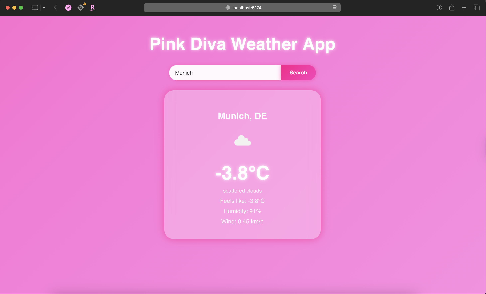
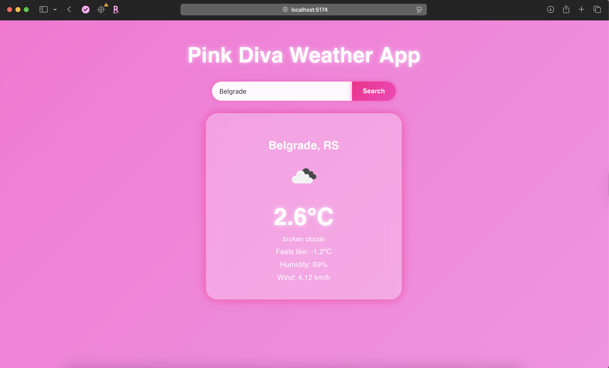
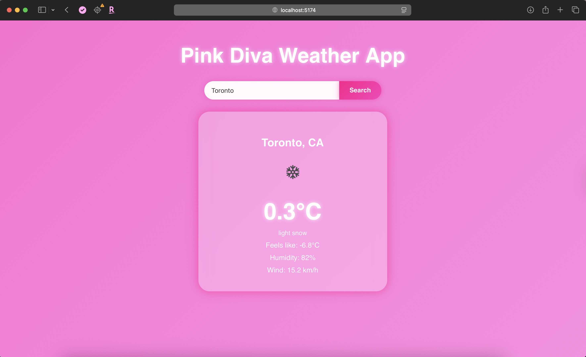
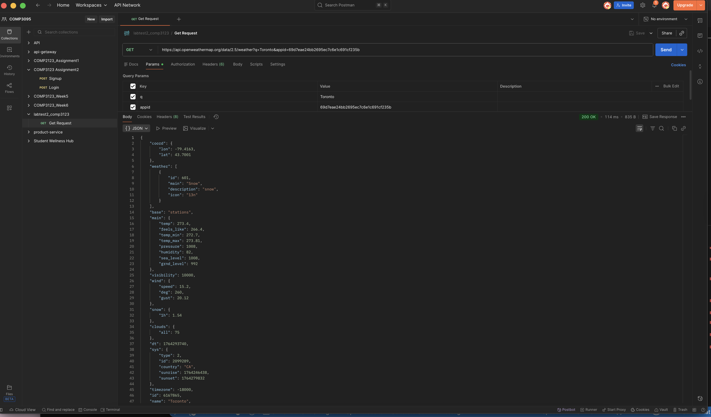
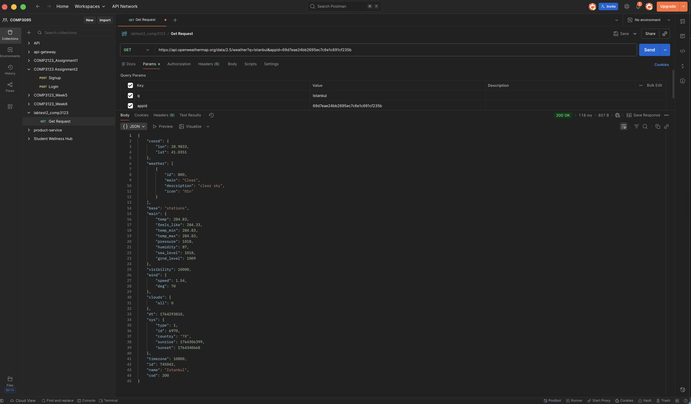
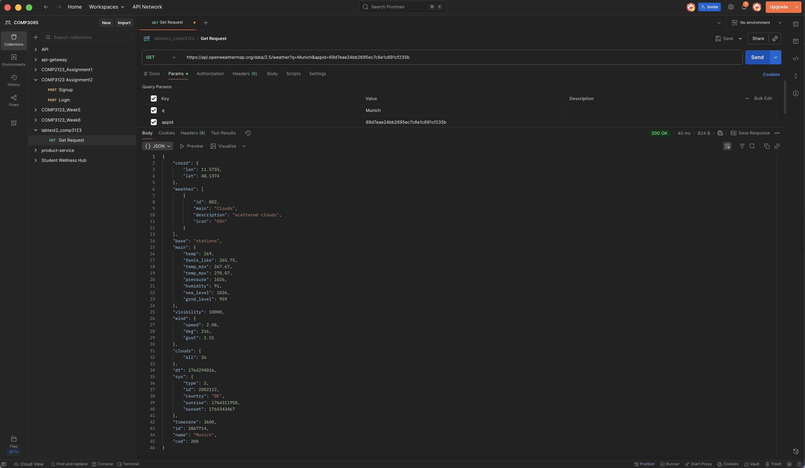

# Pink Diva Weather App

A gorgeous, glassy, animated **weather forecast app** designed with a full pink aesthetic theme 
This application allows users to search any city worldwide and instantly view real-time weather conditions using the **OpenWeather API**, displayed inside a soft glowing UI card.

---

## ✨ Features

| Feature | Description |
|--------|-------------|
| 🌍 Global Weather Search | Enter any city in the world and view current conditions |
| 🌡 Temperature + Feels Like | Displays real temperature and feels-like reading |
| ☁ Weather Conditions | Shows status such as clear sky, snow, clouds, rain etc. |
| 💧 Humidity + Wind | Live atmospheric data from OpenWeather API |
| 🎀 UI Design | Fully pink theme with gradients, blur card and glow effects |
| ⚡ Fast + Responsive | Built using React + Vite for instant performance |

---

## 🔧 Technologies Used

| Tech | Purpose |
|------|----------|
| **React (Vite)** | Front-end framework |
| **OpenWeather API** | Weather data source |
| **CSS Glassmorphism** | UI styling + glow effect |
| **JavaScript / Fetch API** | API calls & logic |

---

## 🛠 Installation & Setup

Clone the repository:

```bash
git clone <your_repo_link>
cd pink-weather-app
npm install
```

---

### 🔑 Create & Add Your API Key

You will need an **OpenWeather API key**.  
Create a file named:

```
.env
```

Inside put:

```
VITE_WEATHER_API_KEY=your_api_key_here
```

⚠ *Do not push your real key to GitHub — replace it with a placeholder before upload.*

---

## ▶ Run the App

```bash
npm run dev
```

Then open:

```
http://localhost:5174
```

---

## 📸 Screenshots


| Munich | Detroit |
|-------|----------|
|  |  |

| Belgrade | Istanbul | Toronto |
|---------|----------|----------|
|  |  |  |


| Postman Toronto | Postman Istanbul | Postman Munich|
|---------|----------|----------|
|  |  |  |

PostmanToronto.png

---

## 💡 What I Learned

- How to work with **API requests** in React  
- How to hide API keys using **Vite environment variables**  
- Styling using **gradients, blur & neon glow UI**  
- Debugging imports + environment setup  
- Building a responsive and aesthetic interface

---

## ⭐ Future Enhancements

- 5-day forecast
- Weather-based animated backgrounds
- Celsius ↔ Fahrenheit toggle
- Saved cities list
- Dark mode theme

---

## 💗 Author

**Melissa Paksoy**  
Pink Diva Weather App – 2025 🌸  
George Brown College COMP3123  
